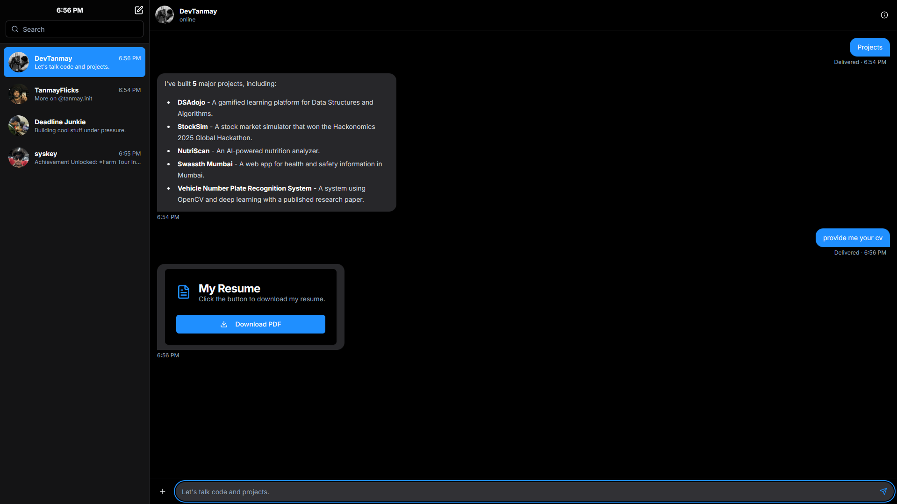

# Tanmay's Interactive Chatfolio

Welcome to my interactive portfolio! This project reimagines the personal website as a dynamic, multi-persona chatbot. Instead of browsing through static pages, you can have a conversation with different facets of my personality and career. Ask about my projects, my photography, my hackathon experiences, or my life as a gamer.

This project is built with Next.js and powered by Google's Gemini through Genkit.

👉 Live here: **[tanmaydeo.vercel.app](https://tanmaydeo.vercel.app/)**





## ✨ Features

- **Multi-Persona Chat Interface**: Switch between four distinct personas:
    - **DevTanmay**: The professional software developer.
    - **TanmayFlicks**: The creative photographer.
    - **Deadline Junkie**: The competitive hackathon builder.
    - **syskey**: The casual gamer.
- **AI-Powered Conversations**: Each persona uses Google's Gemini model, fed with specific data, to hold natural and context-aware conversations.
- **Interactive Components**: The chatbot can respond with rich, interactive components, such as a downloadable resume card or a full photo gallery with a lightbox.
- **Responsive Design**: A seamless experience on both desktop and mobile, with a slide-out sidebar for easy navigation on smaller screens.
- **Dark/Light Mode**: A sleek and modern UI with a theme toggle, defaulting to dark mode for the best first impression.
- **Performant**: Built with Next.js App Router and optimized for performance. Interactive components are lazy-loaded to ensure fast initial load times.

## 🛠️ Tech Stack

- **Framework**: [Next.js](https://nextjs.org/) (App Router)
- **Language**: [TypeScript](https://www.typescriptlang.org/)
- **AI Framework**: [Genkit](https://firebase.google.com/docs/genkit)
- **Generative Model**: [Google Gemini](https://ai.google.dev/)
- **Styling**: [Tailwind CSS](https://tailwindcss.com/)
- **UI Components**: [ShadCN UI](https://ui.shadcn.com/)
- **Icons**: [Lucide React](https://lucide.dev/)

## 🚀 Getting Started

To run this project locally, follow these steps:

### Prerequisites

- [Node.js](https://nodejs.org/en) (v18 or later)
- An active Google AI Studio API key.

### 1. Clone the Repository

```bash
git clone https://github.com/syskey8/personal-portfolio.git
cd personal-portfolio
```

### 2. Install Dependencies

```bash
npm install
```

### 3. Set Up Environment Variables

Create a new file named `.env` in the root of your project and add your Google AI Studio API key:

```env
GEMINI_API_KEY=your_api_key_here
```

### 4. Run the Development Server

```bash
npm run dev
```

The application will be available at `http://localhost:9002`.

## 📂 Project Structure

```
.
├── public/                # Static assets (images, resume.pdf)
├── src/
│   ├── app/               # Next.js App Router pages and layout
│   ├── components/
│   │   ├── chat/          # Components for the chat interface
│   │   ├── responses/     # Interactive components for bot replies
│   │   ├── ui/            # ShadCN UI components
│   │   └── landing-page.tsx # The initial homepage
│   ├── ai/
│   │   ├── flows/         # Genkit AI flows
│   │   └── genkit.ts      # Genkit configuration
│   └── lib/
│       ├── data/          # JSON data files for each persona
│       └── types.ts       # TypeScript type definitions
├── package.json
└── tailwind.config.ts
```

## 🎨 Customization

This project is designed to be a template. To make it your own:

1.  **Update Persona Data**: Modify the JSON files in `src/lib/` (`developer-data.json`, `gamer-data.json`, etc.) with your own information, projects, and experiences.
2.  **Customize Prompts**: Edit the AI prompts in `src/ai/flows/main-chat-flow.ts` to change the personality and instructions for each persona.
3.  **Replace Static Assets**:
    -   Add your own images to the `public/` folder and update the paths in `src/lib/data.ts`.
    -   Place your resume in `public/` and ensure the filename matches the one in `src/components/chat/responses/resume-card.tsx`.
4.  **Style and Theme**: Adjust the theme and colors in `src/app/globals.css` and the Tailwind configuration (`tailwind.config.ts`) to match your personal brand.
